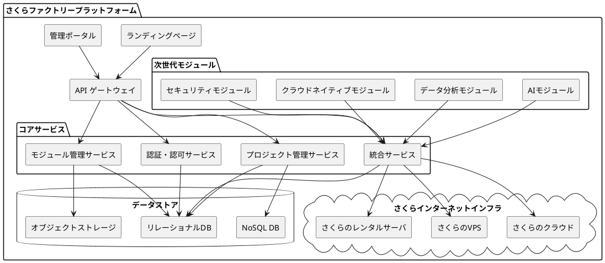

# さくらファクトリー 全体アーキテクチャ

## 概要

本ドキュメントでは、さくらファクトリーの全体アーキテクチャについて詳述します。さくらファクトリーは、さくらインターネットの未来を創造する革新的開発プラットフォームとして、次世代モジュールとサービスを開発・提供するためのシステム基盤です。本アーキテクチャは、高い拡張性、セキュリティ、パフォーマンスを実現するために設計されています。

## アーキテクチャ原則

さくらファクトリーのアーキテクチャは、以下の原則に基づいて設計されています：

1. **モジュール性**
   - 独立したモジュールによる構成
   - 明確に定義されたインターフェース
   - 疎結合・高凝集の設計

2. **スケーラビリティ**
   - 水平スケーリングを前提とした設計
   - マイクロサービスアーキテクチャの採用
   - 非同期処理の積極的活用

3. **セキュリティ**
   - セキュリティバイデザインの原則
   - 多層防御アプローチ
   - 最小権限の原則

4. **可観測性**
   - 包括的なロギング
   - 詳細なメトリクス収集
   - 分散トレーシング

5. **互換性**
   - さくらインターネット既存インフラとの互換性
   - 業界標準プロトコルの採用
   - 柔軟な統合オプション

## システム概要図

以下にさくらファクトリーの全体システム概要を示します：

## コンポーネント詳細

### フロントエンド

#### ランディングページ

- **技術スタック**: Next.js + TypeScript + Tailwind CSS
- **目的**: さくらファクトリーの価値提案、製品・サービス紹介、問い合わせ窓口の提供
- **主要機能**:
  - 製品・サービス紹介
  - 技術仕様の提示
  - 問い合わせフォーム
  - リソースダウンロード

#### 管理ポータル

- **技術スタック**: Next.js + TypeScript + Tailwind CSS
- **目的**: さくらインターネット内部ユーザー向けの管理インターフェース
- **主要機能**:
  - プロジェクト管理
  - モジュール管理
  - 統合設定
  - パフォーマンスモニタリング
  - ユーザー管理

### バックエンド

#### API ゲートウェイ

- **技術スタック**: Node.js + Express / NestJS
- **目的**: 各マイクロサービスへのルーティング、認証・認可、レート制限
- **主要機能**:
  - リクエストルーティング
  - API認証・認可
  - レート制限
  - リクエスト/レスポンス変換
  - API文書化（OpenAPI）

#### 認証・認可サービス

- **技術スタック**: Node.js + TypeScript
- **目的**: ユーザー認証、アクセス制御、セッション管理
- **主要機能**:
  - ユーザー認証
  - ロールベースアクセス制御
  - トークン管理
  - セッション管理
  - 監査ログ

#### プロジェクト管理サービス

- **技術スタック**: Node.js + TypeScript
- **目的**: プロジェクトのライフサイクル管理
- **主要機能**:
  - プロジェクト作成・更新・削除
  - チーム管理
  - タスク管理
  - リソース割り当て
  - 進捗追跡

#### モジュール管理サービス

- **技術スタック**: Node.js + TypeScript
- **目的**: 次世代モジュールの管理、バージョン管理、配布
- **主要機能**:
  - モジュールのカタログ管理
  - バージョン管理
  - 依存関係管理
  - 配布管理
  - 互換性チェック

#### 統合サービス

- **技術スタック**: Node.js + TypeScript
- **目的**: さくらインターネットインフラとの統合管理
- **主要機能**:
  - 統合設定
  - デプロイメント管理
  - 移行サポート
  - 健全性チェック
  - 統合テスト

### 次世代モジュール

#### クラウドネイティブモジュール

- **技術スタック**: Go / Rust
- **目的**: クラウドネイティブ環境に最適化されたインフラストラクチャコンポーネント
- **主要機能**:
  - コンテナオーケストレーション拡張
  - サーバーレスコンピューティング
  - サービスメッシュ
  - クラウドネイティブストレージ

#### セキュリティモジュール

- **技術スタック**: Rust / Go
- **目的**: 高度なセキュリティ機能の提供
- **主要機能**:
  - 脅威検知
  - 脆弱性スキャン
  - セキュリティポリシー管理
  - コンプライアンス監視
  - 暗号化管理

#### AIモジュール

- **技術スタック**: Python / TensorFlow / PyTorch
- **目的**: AI/ML機能の提供
- **主要機能**:
  - 予測分析
  - 異常検知
  - 自然言語処理
  - 画像認識
  - レコメンデーション

#### データ分析モジュール

- **技術スタック**: Python / Apache Spark
- **目的**: 大規模データ分析機能の提供
- **主要機能**:
  - データパイプライン
  - リアルタイム分析
  - データウェアハウス連携
  - ビジュアライゼーション
  - ETL処理

### データストア

#### リレーショナルDB

- **技術**: PostgreSQL
- **用途**: 構造化データ、トランザクションデータ
- **主要データ**:
  - ユーザー情報
  - プロジェクト情報
  - モジュールメタデータ
  - 設定情報

#### NoSQL DB

- **技術**: MongoDB
- **用途**: 非構造化/半構造化データ、高スループットデータ
- **主要データ**:
  - ログデータ
  - イベントデータ
  - テレメトリデータ
  - 一時的なデータ

#### オブジェクトストレージ

- **技術**: MinIO (S3互換)
- **用途**: 大容量バイナリデータ
- **主要データ**:
  - モジュールバイナリ
  - 設計文書
  - バックアップデータ
  - メディアファイル

## 通信プロトコル

### 内部通信

- **同期通信**: REST API (OpenAPI仕様)
- **非同期通信**: Apache Kafka / RabbitMQ
- **ストリーミング**: gRPC

### 外部通信

- **API**: REST API (OpenAPI仕様)
- **認証**: OAuth 2.0 / OpenID Connect
- **データ形式**: JSON / Protocol Buffers

## セキュリティアーキテクチャ

### 認証・認可

- **ユーザー認証**: OAuth 2.0 / OpenID Connect
- **サービス間認証**: mTLS (相互TLS)
- **アクセス制御**: RBAC (ロールベースアクセス制御)
- **シークレット管理**: HashiCorp Vault

### データセキュリティ

- **保存データ暗号化**: AES-256
- **転送中データ暗号化**: TLS 1.3
- **データマスキング**: 機密データの自動マスキング
- **データ分類**: 機密レベルに基づくデータ分類

### ネットワークセキュリティ

- **ネットワーク分離**: VPC / サブネット分離
- **ファイアウォール**: ネットワークACL / セキュリティグループ
- **WAF**: Webアプリケーションファイアウォール
- **DDoS対策**: レート制限 / トラフィックフィルタリング

### 監視・検知

- **ログ監視**: 集中ログ管理
- **脅威検知**: 異常検知 / シグネチャベース検知
- **脆弱性管理**: 定期的な脆弱性スキャン
- **インシデント対応**: 自動アラート / エスカレーションプロセス

## デプロイメントアーキテクチャ

### 開発環境

- **インフラストラクチャ**: さくらのクラウド開発環境
- **コンテナ化**: Docker
- **CI/CD**: GitHub Actions
- **環境分離**: 開発 / テスト / ステージング

### 本番環境

- **インフラストラクチャ**: さくらのクラウド本番環境
- **コンテナオーケストレーション**: Kubernetes
- **サービスメッシュ**: Istio
- **スケーリング**: 水平自動スケーリング

### ディザスタリカバリ

- **バックアップ戦略**: 定期的な自動バックアップ
- **リージョン冗長性**: マルチリージョンデプロイメント
- **フェイルオーバー**: 自動フェイルオーバー
- **復旧計画**: 詳細なDRプラン

## 可観測性アーキテクチャ

### ロギング

- **集中ログ管理**: ELK Stack (Elasticsearch, Logstash, Kibana)
- **ログフォーマット**: 構造化ログ (JSON)
- **ログレベル**: DEBUG, INFO, WARN, ERROR, FATAL
- **ログ保持**: 短期（7日）、長期（1年）

### モニタリング

- **メトリクス収集**: Prometheus
- **ダッシュボード**: Grafana
- **アラート**: Alertmanager
- **ヘルスチェック**: Readiness / Liveness プローブ

### トレーシング

- **分散トレーシング**: Jaeger / OpenTelemetry
- **パフォーマンス分析**: トレース分析
- **ボトルネック検出**: レイテンシ分析
- **エラー追跡**: エラーコンテキスト収集

## 統合アーキテクチャ

### さくらのクラウド統合

- **API統合**: さくらのクラウドAPI連携
- **リソース管理**: クラウドリソースの自動プロビジョニング
- **モニタリング統合**: 統合監視ダッシュボード
- **認証連携**: シングルサインオン

### さくらのVPS統合

- **デプロイメント**: 自動デプロイメントパイプライン
- **設定管理**: Infrastructure as Code
- **バックアップ統合**: 統合バックアップソリューション
- **セキュリティ統合**: 統合セキュリティポリシー

### さくらのレンタルサーバ統合

- **アプリケーションデプロイ**: 互換性のあるデプロイメントプロセス
- **データ同期**: 双方向データ同期
- **ドメイン管理**: 統合ドメイン管理
- **SSL/TLS管理**: 統合証明書管理

## スケーラビリティ設計

### 水平スケーリング

- **ステートレスサービス**: 水平スケーリング対応設計
- **ロードバランシング**: L7ロードバランサー
- **セッション管理**: 分散セッションストア
- **キャッシュ**: 分散キャッシュ (Redis)

### データベーススケーリング

- **シャーディング**: データ分割戦略
- **レプリケーション**: マスター/スレーブレプリケーション
- **接続プーリング**: 効率的な接続管理
- **クエリ最適化**: パフォーマンスチューニング

### 非同期処理

- **メッセージキュー**: Kafka / RabbitMQ
- **バックグラウンドジョブ**: 非同期タスク処理
- **イベント駆動アーキテクチャ**: イベントベースの連携
- **バッチ処理**: 効率的なバッチ処理設計

## 拡張性設計

### プラグインアーキテクチャ

- **プラグインインターフェース**: 標準化されたプラグインAPI
- **プラグイン検出**: 動的プラグイン検出
- **バージョン管理**: プラグインバージョン互換性
- **分離**: プラグイン実行の分離

### APIバージョニング

- **バージョン管理戦略**: URI / ヘッダー / コンテンツネゴシエーション
- **後方互換性**: 互換性レイヤー
- **非推奨プロセス**: 段階的な機能廃止
- **ドキュメント**: バージョン別API文書

### 設定管理

- **外部化設定**: 環境変数 / 設定ファイル
- **動的設定**: 実行時設定変更
- **設定階層**: デフォルト / 環境別 / インスタンス別
- **検証**: 設定値の検証

## 技術的負債管理

### コード品質

- **コーディング規約**: 厳格なコーディング規約
- **静的解析**: 自動コード解析
- **コードレビュー**: 体系的なレビュープロセス
- **リファクタリング**: 計画的なリファクタリング

### テスト戦略

- **単体テスト**: 高いカバレッジの単体テスト
- **統合テスト**: コンポーネント間の統合テスト
- **パフォーマンステスト**: 負荷テスト / ストレステスト
- **セキュリティテスト**: SAST / DAST / ペネトレーションテスト

### ドキュメント

- **コードドキュメント**: 自己文書化コード
- **API文書**: OpenAPI仕様
- **アーキテクチャ文書**: アーキテクチャ決定記録 (ADR)
- **運用文書**: 運用手順書 / トラブルシューティングガイド

## 将来の拡張性

### 新技術対応

- **クラウドネイティブ技術**: 新しいクラウドネイティブ技術の統合
- **エッジコンピューティング**: エッジデプロイメントのサポート
- **サーバーレス**: サーバーレスアーキテクチャの拡張
- **量子コンピューティング**: 将来的な量子コンピューティング対応の準備

### 新サービス統合

- **PaaS拡張**: Platform as a Serviceの拡張
- **SaaS統合**: Software as a Serviceの統合
- **マネージドサービス**: 新しいマネージドサービスの追加
- **サードパーティ統合**: 外部サービスとの統合

## まとめ

さくらファクトリーのアーキテクチャは、モジュール性、スケーラビリティ、セキュリティ、可観測性、互換性の原則に基づいて設計されています。このアーキテクチャにより、さくらインターネットの未来を創造する革新的な次世代モジュールとサービスを効率的に開発・提供し、さくらインターネットのインフラに統合することが可能になります。

本アーキテクチャは、技術の進化や要件の変化に応じて継続的に改善・拡張されるべきものであり、定期的な見直しと更新が推奨されます。
